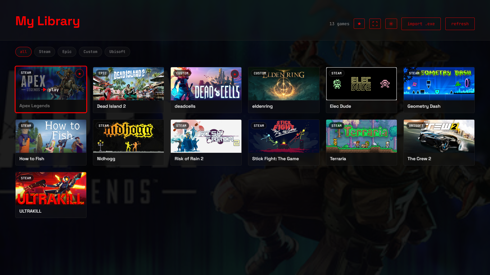
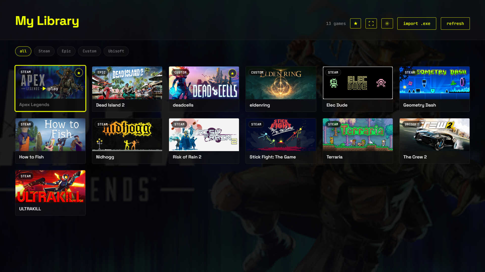

# GameLibrary

### Your games. One library. One place.

A modern Windows desktop application for browsing, organizing, and launching your game collection from a single interface.

<p align="center">

<a href="https://github.com/hassanakq/Game-Library/releases/latest/download/GameLibrary.exe">

</a>

<a href="https://github.com/hassanakq/Game-Library/releases/latest">

</a>

</p>

---

## Overview

GameLibrary is a Windows desktop application designed to bring your games together in one place.

Browse your collection, search for games, view artwork, import custom games, and launch your games directly from the library.

The application combines a web-based frontend with a Python backend to provide a lightweight desktop gaming library.

---

## Interface

<p align="center">
  
</p>
<p align="center">
  
</p>
---

## Features

### Game Library

- Browse your game collection
- Search and filter games
- View game artwork
- Organize your games
- Launch games directly

### Game Artwork

- Automatic game artwork
- Local image caching
- Faster loading after images are cached
- Custom artwork support

### Game Sources

- Steam games
- Epic games
- Ubisoft games
- Custom games
- Local game executables

### Controller Support

- Game controller integration
- Controller-friendly interaction
- Designed with desktop and controller use in mind

---

## Download

### Windows

<p align="center">

<a href="https://github.com/hassanakq/Game-Library/releases/latest/download/GameLibrary.exe">

</a>

</p>

Download the latest version directly from GitHub Releases.

No Python installation is required.

### Installation

1. Download `GameLibrary.exe`.
2. Place it anywhere on your computer.
3. Run `GameLibrary.exe`.
4. Add and launch your games.

---

## Windows SmartScreen

The application is currently not digitally signed, so Windows may display:

> Windows protected your PC

This happens because Windows cannot verify the publisher of the executable.

If you downloaded GameLibrary from this repository and trust the source:

**More info → Run anyway**

A future release may include a digitally signed executable.

---

## Built With

| Technology | Purpose |
|---|---|
| Python | Application backend |
| PyWebView | Desktop application window |
| Pygame | Controller and input handling |
| FastAPI | Backend API |
| HTML | Frontend structure |
| CSS | Interface styling |
| JavaScript | Frontend functionality |
| PyInstaller | Windows executable packaging |

---

## Architecture

```text
                         GameLibrary
                              |
                 +------------+------------+
                 |                         |
              Frontend                  Backend
                 |                         |
          HTML / CSS / JS                Python
                 |                         |
                 +------------+------------+
                              |
                          PyWebView
                              |
                       Windows Desktop
                         /          \
                    Pygame        FastAPI
                       |              |
                 Controller       Game / Image
                    Input              API
